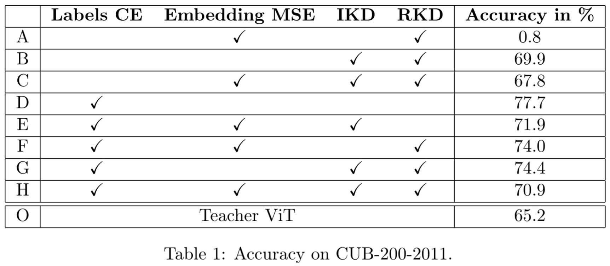
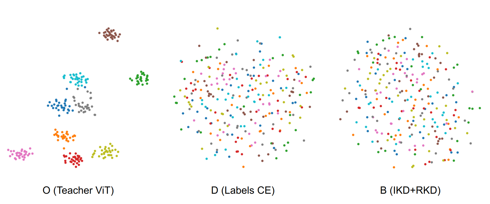
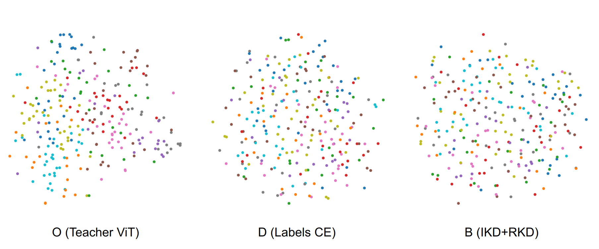

# transformer2cnn
## Distillation of transformer into the CNN for fine-grained image recognition
### [Slides](slides.pdf)
### Summary
- Distillation of the transformer’s knowledge into the CNN is explored.
- It is shown that the CNN can be trained with success using previously trained ViT and no labels.
- Experiments in multiple setups fail to transfer the embedding structure suggesting it may not be trivial with distillation or it is an architecture attribute.
### Results
#### Accuracy
<kbd>
    
</kbd>

#### Clustering on CUB-200-2011
<kbd>
    
</kbd>

#### Clustering on CIFAR-10
<kbd>
    
</kbd>

### Downloads
- [Dataset](https://drive.google.com/uc?export=download&id=1hbzc_P1FuxMkcabkgn9ZKinBwW683j45)
- [Segmentation](https://drive.google.com/uc?export=download&id=1EamOKGLoTuZdtcVYbHMWNpkn3iAVj8TP) 
- [Pretrained ViT logits & CLS](https://ujchmura-my.sharepoint.com/personal/mateusz_pach_student_uj_edu_pl/_layouts/15/onedrive.aspx?id=%2Fpersonal%2Fmateusz%5Fpach%5Fstudent%5Fuj%5Fedu%5Fpl%2FDocuments%2Ftrained%5Flogits%2Ept&parent=%2Fpersonal%2Fmateusz%5Fpach%5Fstudent%5Fuj%5Fedu%5Fpl%2FDocuments&ga=1) 